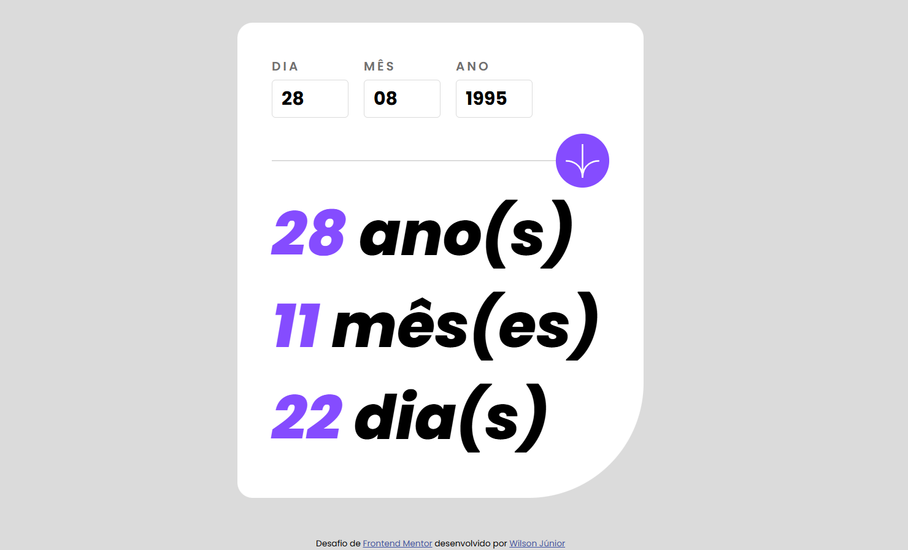

# Frontend Mentor - Solução do aplicativo calculadora de idade

Esta é uma solução para o [desafio do aplicativo calculadora de idade no Frontend Mentor](https://www.frontendmentor.io/challenges/age-calculator-app-dF9DFFpj-Q). Os desafios do Frontend Mentor ajudam você a melhorar suas habilidades de codificação construindo projetos realistas.

## Índice

- [Visão Geral](#visão-geral)
  - [O Desafio](#o-desafio)
  - [Captura de Tela](#captura-de-tela)
  - [Links](#links)
- [Meu Processo](#meu-processo)
  - [Construído com](#construído-com)
  - [O que eu aprendi](#o-que-eu-aprendi)
  - [Desenvolvimento Contínuo](#desenvolvimento-contínuo)
  - [Recursos Úteis](#recursos-úteis)
- [Autor](#autor)
- [Agradecimentos](#agradecimentos)

## Visão Geral

### O Desafio

Os usuários devem ser capazes de:

- Ver a idade em anos, meses e dias após enviar uma data válida através do formulário
- Receber mensagens de erro de validação se:
  - Qualquer campo estiver vazio quando o formulário for enviado
  - O número do dia não estiver entre 1-31
  - O número do mês não estiver entre 1-12
  - O ano estiver no futuro
  - A data for inválida, por exemplo, 31/04/1991 (há 30 dias em abril)
- Ver o layout otimizado para a interface dependendo do tamanho da tela do dispositivo
- Ver estados de foco e hover para todos os elementos interativos na página
- **Bônus**: Ver os números da idade animarem até o número final quando o formulário é enviado

### Captura de Tela



### Links

- URL da Solução:
- URL do Site ao Vivo:

## Meu Processo

### Construído com

- Marcação HTML5 semântica
- Propriedades customizadas do CSS
- Flexbox
- Javascript ES6 Vanilla

### O que eu aprendi

Trabalhar neste projeto me ajudou a melhorar meu entendimento sobre validação de datas e manipulação de entrada do usuário em formulários. Também pratiquei o uso de Flexbox para layouts responsivos.

```html
<section id="results">
  <p><span class="resultado anoss">--</span> anos</p>
  <p><span class="resultado mess">--</span> meses</p>
  <p><span class="resultado dias">--</span> dias</p>
</section>
```

```css
input {
  border: 1px solid var(--slate500);
  padding: 10px;
  border-radius: 5px;
}
```

```js
const calculateAge = (birthDate) => {
  const today = new Date();
  const birth = new Date(birthDate);
  let years = today.getFullYear() - birth.getFullYear();
  let months = today.getMonth() - birth.getMonth();
  let days = today.getDate() - birth.getDate();

  if (days < 0) {
    months--;
    days += new Date(today.getFullYear(), today.getMonth(), 0).getDate();
  }

  if (months < 0) {
    years--;
    months += 12;
  }

  return { years, months, days };
};

document.getElementById("calculate").addEventListener("click", () => {
  const birthDate = document.getElementById("birthDate").value;
  const age = calculateAge(birthDate);
  document.querySelector(".resultado.anoss").textContent = age.years;
  document.querySelector(".resultado.mess").textContent = age.months;
  document.querySelector(".resultado.dias").textContent = age.days;
});
```

### Desenvolvimento Contínuo

Planejo continuar aprimorando minhas habilidades em:

- Gerenciamento de Estado: Quero me tornar mais proficiente em bibliotecas de gerenciamento de estado, como Redux ou Context API, e explorar padrões React mais avançados.
- Design Responsivo: Quero aprimorar minha capacidade de criar layouts responsivos que funcionem perfeitamente em diferentes dispositivos e tamanhos de tela, utilizando técnicas modernas de CSS como Grid e Flexbox.
- Acessibilidade (a11y): Garantir que minhas aplicações sejam acessíveis para todos os usuários é importante para mim. Planejo focar em melhorar meu conhecimento sobre padrões de acessibilidade e melhores práticas.
- Otimização de Desempenho: Quero aprender mais sobre otimização de desempenho em aplicações web, incluindo técnicas para reduzir tempos de carregamento e melhorar a experiência geral do usuário.
- Testes: Quero incorporar testes mais abrangentes em meu fluxo de trabalho, incluindo testes unitários, testes de integração e testes de ponta a ponta usando ferramentas como Jest, React Testing Library e Cypress.

Ao focar nessas áreas, espero melhorar a qualidade e robustez de meus futuros projetos, tornando-os mais eficientes, sustentáveis e amigáveis ao usuário.

### Recursos Úteis

- [MDN Web Docs](https://developer.mozilla.org/) - Este recurso abrangente é meu ponto de referência para qualquer dúvida sobre HTML, CSS ou JavaScript, fornecendo documentação detalhada e exemplos.
- [CSS-Tricks](https://css-tricks.com/) - Acho este site extremamente útil para entender conceitos de CSS e encontrar soluções práticas para desafios comuns de estilização.
- [JavaScript.info](https://javascript.info/) - Este site oferece tutoriais e artigos aprofundados sobre vários tópicos de JavaScript, que têm sido inestimáveis para melhorar meu entendimento da linguagem.
- [Documentação Oficial do React](https://reactjs.org/docs/getting-started.html) - A documentação oficial do React tem sido essencial para aprender os fundamentos e conceitos avançados do React.
- [Frontend Mentor](https://www.frontendmentor.io/) - Trabalhar nos desafios do Frontend Mentor me proporcionou experiência prática na construção de projetos e resolução de problemas do mundo real.

## Autor

- Frontend Mentor - [@WilsonPereiraJr](https://www.frontendmentor.io/profile/WilsonPereiraJr)
